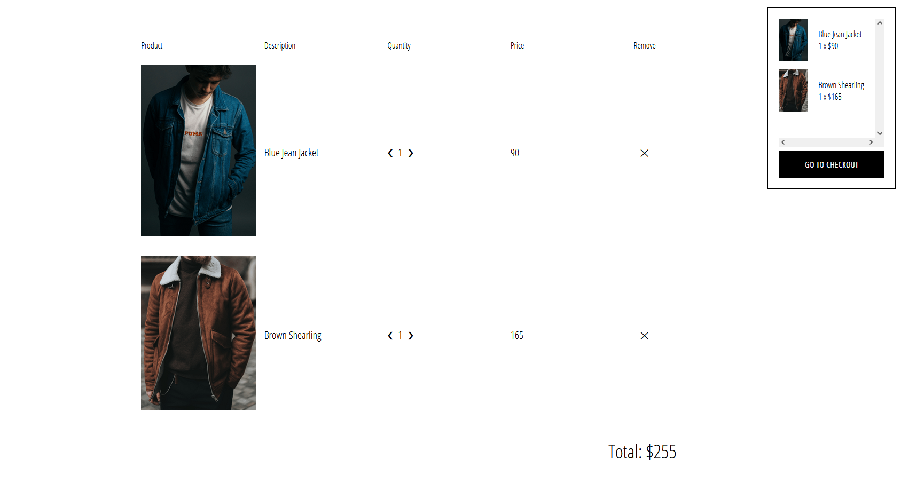
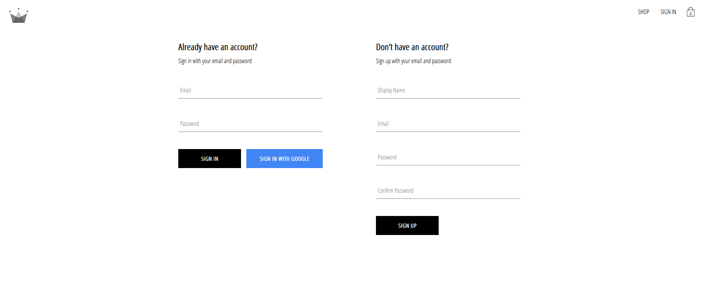

# Clothing-Store

## Description

> Clothing shop made using React & Firebase
>
> The objective of this project was to recreate basic features of an ecommerce, such as shopping cart, product page and user registration
>
> Live demo [_here_](https://clothing-store-sandy.vercel.app/)

## Table of Contents
* [Technologies Used](#technologies-used)
* [Features](#features)
* [Screenshots](#screenshots)

## Technologies Used

- React - version 18.2.0
- Redux - version 4.2.1,
- React-router-rom - version 6.14.1
- Typescript - version 5.0.2
- Firebase
- Sass
- styled-components

## Screenshots

    
Products-Page

     

    
Cart-Page

     

    
Account-Page

    

